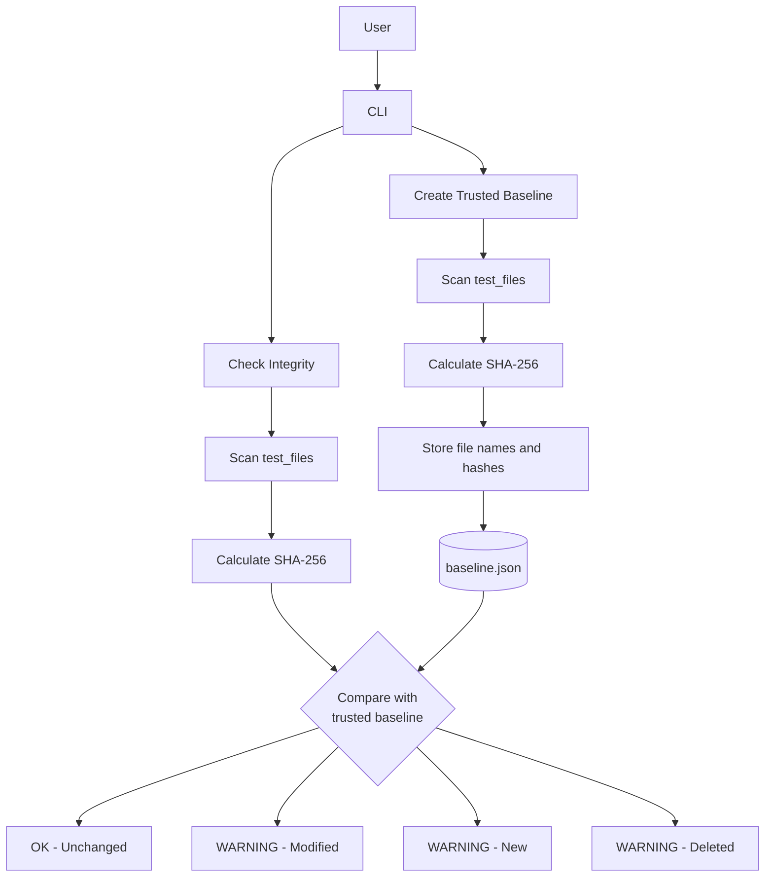

# CybersecurityProject

**Verification code: WTC-A7YZ9GGC**
**YouTube demo link: https://youtu.be/eq_HAF0wTMM**

---

# File Integrity Monitor

A Python-based cybersecurity project that detects unauthorized or unexpected changes to files by comparing their current SHA-256 hashes against a trusted baseline.

## Overview

File integrity is an important part of cybersecurity. If an attacker modifies, replaces, adds, or deletes files on a system, those changes can potentially affect the system's security or functionality.

This project implements a simple **File Integrity Monitor (FIM)** using Python.

The monitor creates a trusted baseline of files and their SHA-256 hashes. During an integrity check, it compares the current state of the monitored directory against that baseline and reports any changes.

The project was developed as part of a cybersecurity elective to demonstrate practical security concepts including hashing, integrity monitoring, baselines, and automated testing.

---

## Cybersecurity Concept

This project focuses on **Integrity**, one of the three principles of the **CIA Triad**:

* **Confidentiality** – protecting information from unauthorized access.
* **Integrity** – ensuring information has not been changed without authorization.
* **Availability** – ensuring systems and information remain accessible.

The File Integrity Monitor focuses specifically on **Integrity** by detecting changes to files.

A FIM does not prevent a file from being changed. Instead, it detects that a change has occurred by comparing the current file against a previously trusted state.

---

## How It Works

The monitor uses **SHA-256 hashing** to create a digital fingerprint for each file.

The process has two main stages:

### 1. Create a Trusted Baseline

The monitor scans the files in the `test_files/` directory, calculates a SHA-256 hash for each file, and stores the file names and hashes in `baseline.json`.

### 2. Check Integrity

When an integrity check is performed, the monitor scans the directory again, calculates the current SHA-256 hashes, and compares them against the trusted baseline.



The baseline acts as the **trusted reference point** for integrity checks.

### SHA-256

SHA-256 is a cryptographic hash function.

A hash acts like a fingerprint for the contents of a file:

```text
File contents
      ↓
   SHA-256
      ↓
 Hash value
```

If the contents of a file change, its SHA-256 hash will normally change as well.

The monitor uses this property to detect modifications.

> Hashing is not encryption. A SHA-256 hash is not intended to be decrypted back into the original file contents.

---

## Features

The current implementation can:

* Create a trusted file baseline.
* Calculate SHA-256 hashes.
* Store the baseline in JSON format.
* Load an existing baseline.
* Detect modified files.
* Detect new files.
* Detect deleted files.
* Report unchanged files.
* Provide a simple command-line interface.
* Run automated unit tests.

---

## Project Structure

```text
CybersecurityProject/
│
├── monitor.py
├── test_monitor.py
├── baseline.json
├── README.md
│
├── test_files/
│   ├── important.txt
│   └── context.txt
│
└── .gitignore
```

### Main files

**`monitor.py`**

Contains the main File Integrity Monitor functionality, including:

* File hashing
* Baseline creation
* Baseline saving/loading
* Integrity checking
* Command-line interface

**`test_monitor.py`**

Contains automated tests for the core functionality.

**`baseline.json`**

Stores the trusted baseline containing file names and their expected SHA-256 hashes.

**`test_files/`**

Contains the files used by the project for demonstration and testing.

---

## Installation

### Requirements

* Python 3
* Git (optional, for cloning the repository)

No external Python packages are required.

### Clone the repository

```bash
git clone https://github.com/Shauna91776/CybersecurityProject.git
```

Navigate into the project:

```bash
cd CybersecurityProject
```

---

## Usage

Run the monitor with:

```bash
python monitor.py
```

The program displays:

```text
========================================
       FILE INTEGRITY MONITOR
========================================

1. Create baseline
2. Check integrity
3. Exit

Select an option:
```

### 1. Create baseline

Selecting option `1` scans the monitored directory and creates a trusted baseline.

Example:

```text
Creating baseline...
Baseline created successfully.
```

The baseline is stored in:

```text
baseline.json
```

### 2. Check integrity

Selecting option `2` compares the current files against the stored baseline.

If a file has not changed:

```text
[OK] important.txt
```

If a file has been modified:

```text
[WARNING] File modified: important.txt
```

If a new file is found:

```text
[WARNING] New file detected: new_file.txt
```

If a baseline file is missing:

```text
[WARNING] File deleted: context.txt
```

### 3. Exit

Selecting option `3` exits the program.

---

## Example Detection Scenario

A typical integrity check can look like this:

```text
[OK] context.txt
[WARNING] File modified: important.txt
[WARNING] New file detected: new_file.txt
[WARNING] File deleted: old_file.txt
```

This allows a user to quickly identify files whose state differs from the trusted baseline.

---

## Testing

The project includes automated tests using Python's built-in `unittest` framework.

The tests cover:

* Consistent SHA-256 hashing.
* Detection of changed file contents.
* Baseline creation.
* Correct hashes stored in the baseline.
* Saving and loading the baseline.
* Detection of modified files.
* Detection of new files.
* Detection of deleted files.

The test suite currently contains **8 tests**.

Run the tests with:

```bash
python -m unittest test_monitor.py
```

A successful test run should report:

```text
Ran 8 tests

OK
```

Temporary test directories are used where appropriate so that automated tests do not modify the project's real files.

---

## Security Considerations

The project demonstrates the basic principles of file integrity monitoring, but it is intentionally a small educational implementation.

### Trusted Baseline

The baseline is important because it represents the expected state of the monitored files.

If an attacker can modify both:

```text
important.txt
```

and:

```text
baseline.json
```

the monitor may no longer be able to detect the modification.

For a production FIM, the baseline should therefore be protected from unauthorized modification.

Possible approaches include:

* Restricting file permissions.
* Storing the baseline in a separate protected location.
* Using digital signatures.
* Using a remote or centralized monitoring system.
* Sending integrity events to a security monitoring system.

### Hashing Limitations

SHA-256 provides a strong cryptographic hash, but the security of a FIM depends on more than the hash algorithm.

The baseline itself must also be protected.

---

## Limitations

This project is designed as an educational prototype rather than a production security solution.

Current limitations include:

* The monitored directory is currently configured in the Python code.
* The baseline is stored locally as a JSON file.
* There is no authentication or access control.
* There is no remote monitoring.
* There is no alerting system such as email or SMS.
* The program reports changes but does not prevent them.
* The program does not identify who made a change.
* The current implementation monitors files directly inside the configured directory rather than providing a more advanced recursive monitoring system.

These limitations provide opportunities for future development.

---

## Future Improvements

Possible future improvements include:

* Allowing users to specify the directory to monitor.
* Supporting recursive directory scanning.
* Protecting the baseline with digital signatures.
* Storing the baseline in a secure remote location.
* Adding timestamps to integrity events.
* Logging events to a security log.
* Adding email or dashboard alerts.
* Running the monitor automatically at scheduled intervals.
* Adding file permissions and ownership monitoring.
* Integrating the monitor with a SIEM or other security monitoring platform.

---

## What I Learned

Through this project, I gained practical experience with:

* The CIA Triad and the concept of **Integrity**.
* Cryptographic hashing and SHA-256.
* File handling in Python.
* JSON data storage.
* Comparing trusted and current system states.
* Detecting modified, new, and deleted files.
* Writing automated tests with `unittest`.
* Using temporary test environments.
* Building a command-line interface.
* Using Git and GitHub to track development.
* Thinking about security limitations rather than only making a program work.

---

## Conclusion

This project demonstrates how a simple File Integrity Monitor can use cryptographic hashing and a trusted baseline to identify changes to files.

While the implementation is intentionally lightweight, it demonstrates an important cybersecurity principle: **detecting unexpected changes is an essential part of protecting system integrity.**
